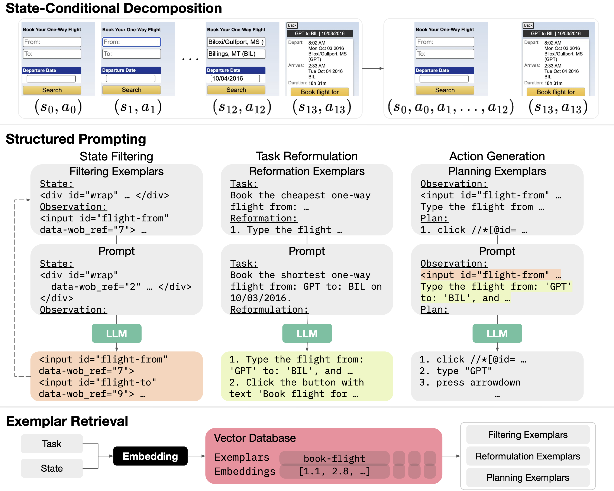
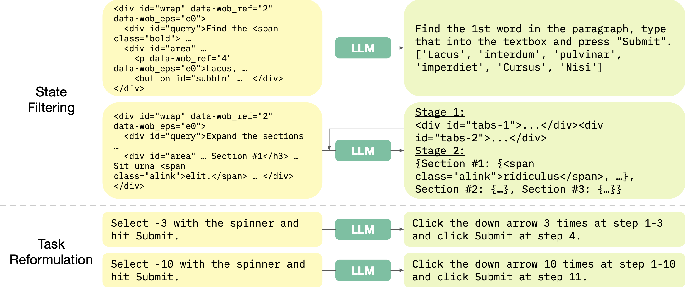
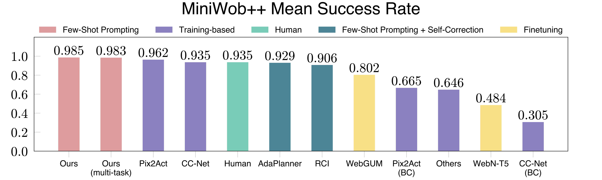
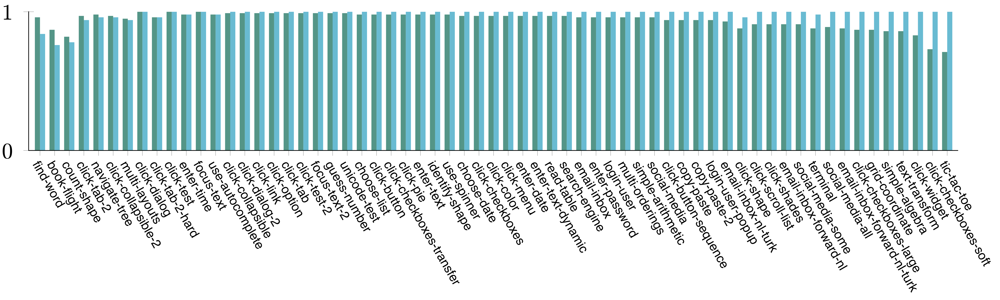

# Synapse: Leveraging Few-Shot Exemplars for Human-Level Computer Control

## Method

Overview:



Examples of structured prompting:



## Results

Mean performance in MiniWob++:



Per-task performance vs Human:




## Install

```bash
conda create -n web python=3.9
conda activate web
pip install -r requirements.txt
cd wob
pip install -e .
```

## Run

Here are example commands. For the complete list of arguments, please refer to the code.

Run `book-flight` with exemplar decomposition:

```bash
python main.py --env_name book-flight --num_episodes 50 --exemplar_decomposition --max_steps 2 --headless
```

Run `count-shape` with different state filtering strategies:

```bash
python main.py --env_name count-shape --num_episodes 50 --no_filter --max_tokens 2048 --headless  # no filtering
python main.py --env_name count-shape-ablation --num_episodes 50 --reformat_input obs_task --max_tokens 2048 --no_multi_task --headless  # vanilla filtering
python main.py --env_name count-shape --num_episodes 50 --reformat_input obs_task --max_tokens 2048 --headless  # multi-stage filtering
```

Run `click-checkboxes-soft` with task reformulation:

```bash
python main.py --env_name click-checkboxes-soft --num_episodes 50 --no_filter --headless  # no reformulation
python main.py --env_name click-checkboxes-soft --num_episodes 50 --no_filter --reformat_input obs --headless  # task reformulation
```

## Citation

```bibtex
@misc{zheng2023synapse,
    title={Synapse: Leveraging Few-Shot Exemplars for Human-Level Computer Control}, 
    author={Longtao Zheng and Rundong Wang and Bo An},
    year={2023},
    eprint={2306.07863},
    archivePrefix={arXiv},
    primaryClass={cs.AI}
}
```
